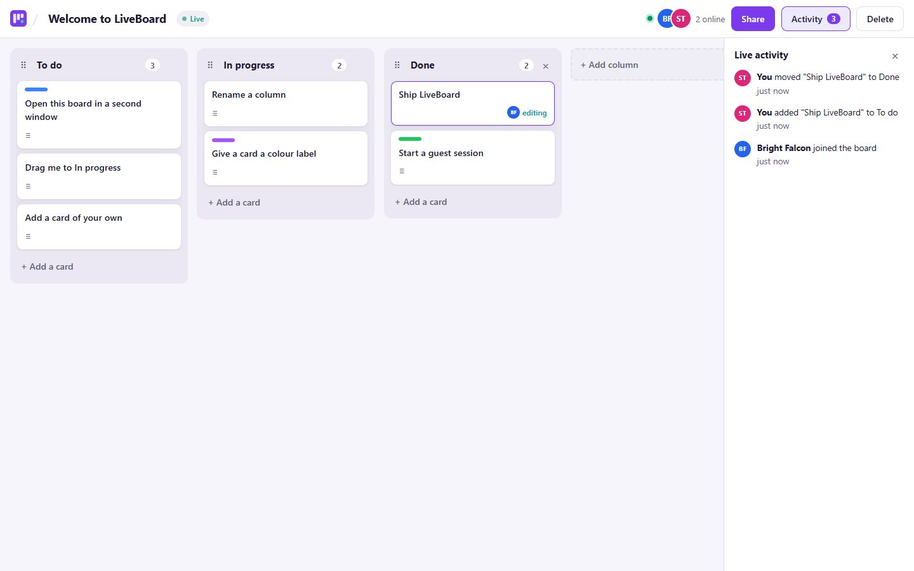

# LiveBoard

**A real-time collaborative Kanban board.** Drag cards between columns, share the board with a link, and watch
everyone's changes appear instantly. No refreshing, no "who has the latest version?".

**Live demo: https://liveboard-tajveed.vercel.app** · No sign-up needed: click **Try the live demo**, then **Share**
and open the link in a private window to see two people editing the same board. The API runs on a free tier that
sleeps when idle, so the first visit can take up to a minute to wake.



| | |
|---|---|
| **Backend** | ASP.NET Core 8 Web API · **SignalR** · EF Core 8 · PostgreSQL · JWT auth · rate limiting |
| **Frontend** | React 19 · TypeScript · Vite · **dnd-kit** (drag and drop) · @microsoft/signalr |
| **Tests** | xUnit: 37 tests incl. real-time tests with two live SignalR clients · Playwright: two-user browser suite |

## Features

- **Boards, columns and cards** with full create / rename / delete, card descriptions and colour labels.
- **Drag and drop** for cards (within and across columns) and for columns, with mouse, touch **or keyboard**.
- **Live sync:** every change is broadcast over SignalR to everyone on the board as soon as it's saved.
- **Share by link:** anyone with the link joins as an editor; the owner can **reset the link** to cut off old ones.
- **Presence:** avatars of who's online right now (two tabs from one person count once).
- **Collaboration awareness:** cards show *"editing"* while someone has them open; if two people edit the same
  card, the second sees a notice, and if the other saves first they're offered *"Load their version"* instead of
  silently overwriting it.
- **Live activity feed:** "Swift Otter moved *Fix login* to Done · just now".
- **Resilient connection:** automatic reconnect with back-off, then a full resync so nothing missed while offline
  is lost. A status pill shows *Live / Reconnecting / Offline*.
- **Guest demo:** one click gives you a friendly random name ("Calm Falcon") and a sample board explaining how to
  try the real-time features.

## How it works

```
 Browser A                      ASP.NET Core API                         Browser B
 ─────────                      ────────────────                         ─────────
 drag card ──► POST /cards/{id}/move
               │ 1. is A a member of the board?           (404 if not)
               │ 2. take the board's lock                 (one write at a time per board)
               │ 3. reorder + save to PostgreSQL
               │ 4. broadcast CardMoved { card, final order of every column touched }
               ▼                                                   │
 apply event ◄──────────── SignalR group "board:{id}" ─────────────┴──► apply event
```

Design decisions:

- **Writes go through REST, the hub only broadcasts.** REST gives validation, proper status codes and rate
  limiting for free; the SignalR hub (`/hubs/board`) handles joining a board, presence and "editing" signals.
- **Events carry the resulting state, not a diff.** A `CardMoved` event contains the complete final card order of
  each column it touched. Applying an event twice is harmless, so the mover's optimistic update followed by the
  server's broadcast is safe, and concurrent moves from different people always converge on the server's order.
- **Per-board serialisation.** Writes to the same board take a per-board lock, so two people dragging at the same
  moment can't interleave their read-reorder-save steps. An integration test fires 40 random moves from two users
  at once and asserts positions stay contiguous with no lost or duplicated cards.
- **Broadcast after save.** Clients only ever see changes that were actually persisted; the broadcast uses no
  cancellation token, so collaborators hear about a saved change even if the caller's request was aborted.
- **Privacy:** non-members get the same 404 as a missing board, so board ids can't be probed, and they can't join
  a board's live channel.
- **Scaling note:** the lock and presence tracking are in-memory (one API instance). Scaling out would use a
  database-level lock and a SignalR backplane such as Redis.

## Running it locally

**Prerequisites:** [.NET SDK 8+](https://dotnet.microsoft.com/download), [Node.js 20+](https://nodejs.org), and
PostgreSQL (a free [Neon](https://neon.tech) database, a local install, or
`docker run -d -e POSTGRES_PASSWORD=postgres -p 5432:5432 postgres:17`).

```bash
# 1. API settings (gitignored)
cd backend/LiveBoard.Api
cp appsettings.Development.example.json appsettings.Development.json
#    set ConnectionStrings:Default and a Jwt:Key of 32+ characters

# 2. API on http://localhost:5082 (migrations run on start; Swagger at /swagger)
cd ..
dotnet run --project LiveBoard.Api

# 3. UI on http://localhost:5175 (proxies /api and /hubs to the API)
cd ../frontend
npm install
npm run dev
```

> **Neon tip:** create the `liveboard` database first. Connecting to a database that doesn't exist through Neon's
> `-pooler` endpoint times out instead of returning an error.

**Try collaboration locally:** open http://localhost:5175, click *Try the live demo*, click *Share*, and open the link
in a private window (a different browser session = a second user).

### Tests

```bash
cd backend
dotnet test
```

37 tests run without a database server or network: the real app is hosted in-memory on SQLite.

- **Unit:** list re-ordering, presence tracking, display names.
- **API integration:** permissions (404 for outsiders, 403 for non-owners), share-link join/reset, card and column
  CRUD with validation, moves within and across columns, column delete, and the 40-concurrent-moves test.
- **Real-time:** two (or more) live SignalR clients, e.g. *Bob moves a card → Alice receives `CardMoved` whose
  order matches a fresh load of the board*, presence join/leave, the editing indicator clearing when a tab closes,
  outsiders rejected from the hub, and `BoardDeleted` reaching members.

> The test project targets `net10.0` (the API targets `net8.0`): the in-memory test server must match the runtime
> it runs on.

## API reference

All endpoints except auth and health require `Authorization: Bearer <token>`.

| Method | Path | Description |
|---|---|---|
| `POST` | `/api/auth/register` · `/login` | `{ email, password, displayName? }` → token |
| `POST` | `/api/auth/guest?withSampleBoard=true` | Temporary guest (random name) + optional sample board |
| `GET` / `POST` | `/api/boards` | Your boards (with counts) / create (`{ title, withDefaultColumns }`) |
| `GET` / `PATCH` / `DELETE` | `/api/boards/{id}` | Full board / rename / delete (owner) |
| `POST` | `/api/boards/{id}/share-token` | Reset the share link (owner) |
| `POST` | `/api/boards/join/{shareToken}` | Join as editor |
| `DELETE` | `/api/boards/{id}/members/me` | Leave a board |
| `POST` / `PATCH` / `DELETE` | `/api/boards/{id}/columns[/{columnId}]` | Create / rename / delete columns |
| `POST` | `/api/boards/{id}/columns/{columnId}/move` | `{ toIndex }` → new column order |
| `POST` / `PATCH` / `DELETE` | `/api/boards/{id}/cards[/{cardId}]` | Create / edit (title, description, color) / delete |
| `POST` | `/api/boards/{id}/cards/{cardId}/move` | `{ toColumnId, toIndex }` → final orders |

**SignalR hub** `/hubs/board` (JWT via `?access_token=`):
`JoinBoard(boardId)` → online users · `SetEditing(cardId | null)` · `LeaveBoard()`.
Server events: `BoardUpdated`, `BoardDeleted`, `ColumnCreated`, `ColumnUpdated`, `ColumnDeleted`, `ColumnsReordered`,
`CardCreated`, `CardUpdated`, `CardDeleted`, `CardMoved`, `MemberJoined`, `PresenceChanged`, `EditingChanged`.

## Deploying (Vercel + Render + Neon)

1. **Neon:** create a `liveboard` database (AWS Frankfurt) and copy its connection string.
2. **Render:** *New → Blueprint* → this repo (`render.yaml`: Docker, Frankfurt, health check `/api/health`).
   Set `ConnectionStrings__Default` and `Cors__Origins__0` (your exact Vercel URL). Render supports the WebSocket
   connections SignalR uses.
3. **Vercel:** import the repo, Root Directory `frontend`, `VITE_API_BASE_URL` = your Render URL.

---

Built by [Tajveed Aslam](https://tajveed-portfolio.vercel.app) · [GitHub](https://github.com/tajveed-aslam)
